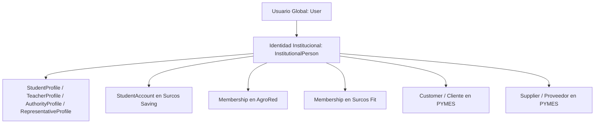
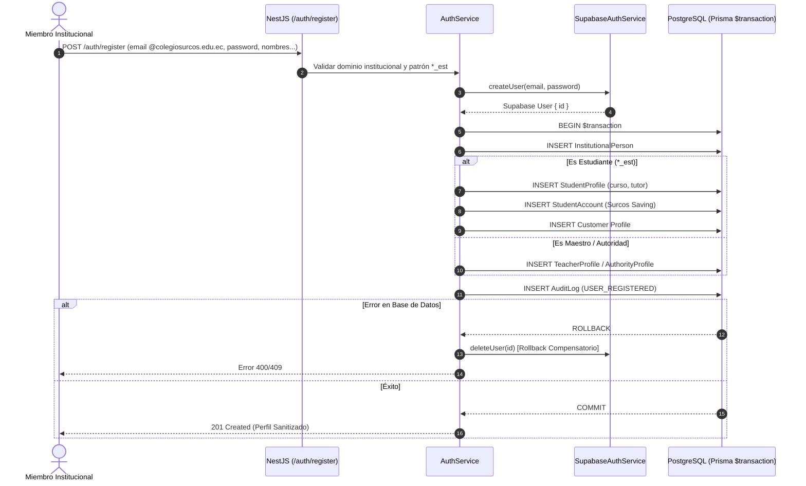
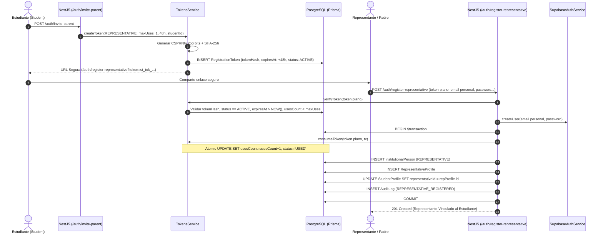
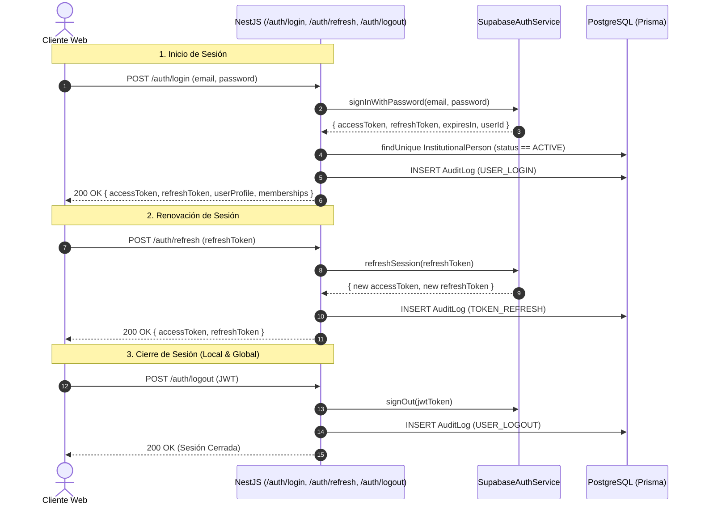
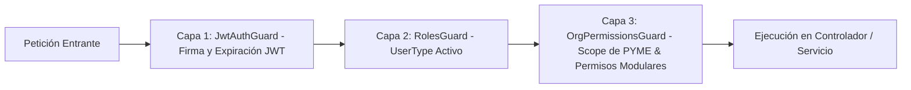

# Auth Architecture & Flow Specifications — Surcos 360 (PRD v1.0)

## 1. Arquitectura de Identidad Desacoplada

---

## 2. Flujo de Registro Institucional

---

## 3. Flujo de Invitación y Registro de Representantes Legales (§3.4 PRD v1.0)

---

## 4. Sesiones y Ciclo de Vida de Autenticación

---

## 5. Autorización de Tres Capas

