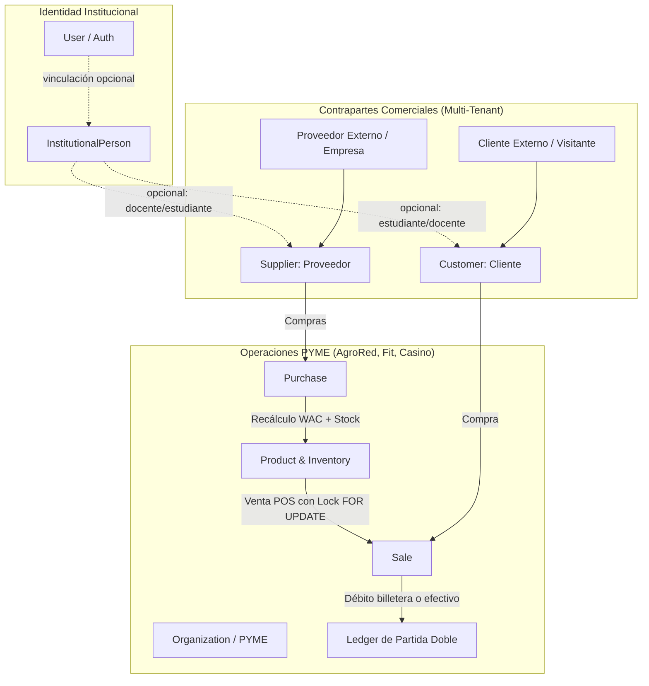
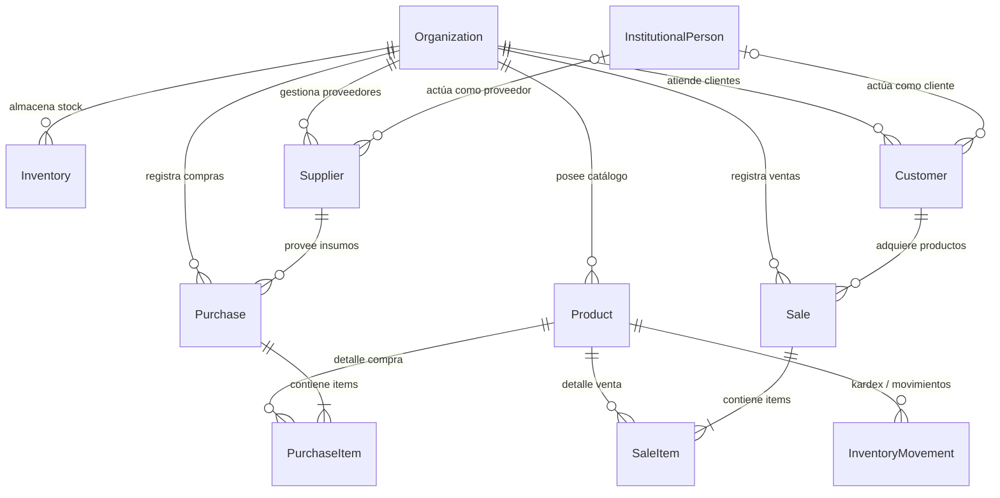

# Commercial & Counterparties Engine (`/commercial` & PYMEs) — Surcos 360

## 1. Arquitectura y Visión General

El módulo de **Comercial y Contrapartes** proporciona un motor multi-tenant unificado para que cualquier PYME del ecosistema Surcos 360 (AgroRed, Surcos Fit, Surcasino, etc.) gestione compras a proveedores, catálogo de productos, inventarios valorados bajo costo promedio ponderado (WAC) y ventas a clientes en Punto de Venta (POS).

---

## 2. Principio Arquitectónico Fundamental: Identidad $\neq$ Contraparte Comercial

1. **Proveedores (`Supplier`):**
   * Un proveedor **NO** requiere obligatoriamente una cuenta de usuario (`User` / `InstitutionalPerson`) en Surcos 360. Puede ser una empresa externa (con RUC, razón social, condiciones de pago).
   * Un usuario de Surcos 360 (ej. un docente que provee insumos agrícolas) puede actuar como proveedor asociando su `institutionalPersonId` de forma explícita y opcional, sin duplicar su identidad.
2. **Clientes (`Customer`):**
   * Un cliente externo puede comprar en una PYME sin tener cuenta institucional (`customerType = EXTERNAL`).
   * Los miembros de la comunidad escolar (estudiantes, docentes, padres, autoridades) se vinculan a través de `institutionalPersonId`, permitiendo que el estudiante pague utilizando su `StudentAccount`.

---

## 3. Modelo de Dominio

---

## 4. Flujos Comerciales Clave

### 4.1 Compras y Recálculo de Costo Promedio Ponderado (WAC)
Al registrar una compra (`POST /organizations/:orgId/commercial/purchases`):
1. Se valida que el proveedor pertenezca a la organización y esté activo.
2. Se adquiere bloqueo de fila sobre el producto y el inventario.
3. Se recalcula el WAC atómicamente:
   $$\text{WAC}_{\text{nuevo}} = \frac{(\text{Stock}_{\text{actual}} \times \text{WAC}_{\text{antiguo}}) + (\text{Cantidad}_{\text{compra}} \times \text{CostoUnitario}_{\text{compra}})}{\text{Stock}_{\text{actual}} + \text{Cantidad}_{\text{compra}}}$$
4. Se incrementa el stock en `Inventory`.
5. Se registra el movimiento en `InventoryMovement` (`MovementType.PURCHASE`).
6. Se crea la compra y su registro en `AuditLog`.

### 4.2 Ventas POS con Control de Concurrencia y Ledger
Al registrar una venta (`POST /organizations/:orgId/commercial/sales`):
1. Se adquiere bloqueo `SELECT ... FOR UPDATE` sobre las filas de producto e inventario.
2. Se verifica que haya stock suficiente para cada producto.
3. Se descuenta el inventario y se genera `InventoryMovement` (`MovementType.SALE`).
4. Se calcula el costo de venta ($\text{COGS} = \sum \text{cantidad} \times \text{WAC}$) y la ganancia bruta ($\text{Total} - \text{COGS}$).
5. **Si el pago es con `STUDENT_ACCOUNT`:**
   - Se verifica que el saldo disponible en el ledger sea $\ge$ total de la venta.
   - Se emite una transacción de partida doble:
     - `DEBIT` StudentAccount (disminuye saldo del estudiante)
     - `CREDIT` LedgerAccount de Ingresos de la PYME
6. **Si el pago es con `CASH` / otros:**
   - `DEBIT` Caja/Efectivo de la PYME (Activo)
   - `CREDIT` LedgerAccount de Ingresos de la PYME
7. Se guarda la venta con sus `SaleItem`s y se audita en `AuditLog`.

---

## 5. Matriz de Endpoints y Roles

| Método | Endpoint | Roles Mínimos Permitidos | Descripción |
|---|---|---|---|
| `GET` | `/organizations/:orgId/commercial/summary` | `VIEWER`, `EMPLOYEE`, `MANAGER`, `ADMIN`, `OWNER` | KPIs comerciales consolidados, valoración de inventario y alertas. |
| `GET` | `/organizations/:orgId/commercial/products` | `VIEWER`, `EMPLOYEE`, `MANAGER`, `ADMIN`, `OWNER` | Catálogo de productos con niveles de stock. |
| `POST` | `/organizations/:orgId/commercial/products` | `MANAGER`, `ADMIN`, `OWNER` | Creación de producto e inicialización de inventario. |
| `GET` | `/organizations/:orgId/commercial/products/:id` | `VIEWER`, `EMPLOYEE`, `MANAGER`, `ADMIN`, `OWNER` | Detalle de producto con histórico de movimientos. |
| `PATCH`| `/organizations/:orgId/commercial/products/:id` | `MANAGER`, `ADMIN`, `OWNER` | Actualización de precio, categoría o stock mínimo. |
| `POST` | `/organizations/:orgId/commercial/inventory/adjust`| `MANAGER`, `ADMIN`, `OWNER` | Ajuste manual de stock con justificación y kardex. |
| `GET` | `/organizations/:orgId/commercial/suppliers` | `VIEWER`, `EMPLOYEE`, `MANAGER`, `ADMIN`, `OWNER` | Listado multi-tenant de proveedores. |
| `POST` | `/organizations/:orgId/commercial/suppliers` | `MANAGER`, `ADMIN`, `OWNER` | Registro de proveedor externo o institucional. |
| `GET` | `/organizations/:orgId/commercial/customers` | `VIEWER`, `EMPLOYEE`, `MANAGER`, `ADMIN`, `OWNER` | Listado de clientes con compras acumuladas. |
| `POST` | `/organizations/:orgId/commercial/customers` | `EMPLOYEE`, `MANAGER`, `ADMIN`, `OWNER` | Registro de cliente externo o institucional. |
| `POST` | `/organizations/:orgId/commercial/purchases` | `MANAGER`, `ADMIN`, `OWNER` | Registro de compra con recálculo de WAC y aumento de stock. |
| `GET` | `/organizations/:orgId/commercial/purchases` | `VIEWER`, `EMPLOYEE`, `MANAGER`, `ADMIN`, `OWNER` | Historial de compras a proveedores. |
| `POST` | `/organizations/:orgId/commercial/sales` | `EMPLOYEE`, `MANAGER`, `ADMIN`, `OWNER` | Checkout POS con bloqueo de concurrencia y ledger. |
| `GET` | `/organizations/:orgId/commercial/sales` | `VIEWER`, `EMPLOYEE`, `MANAGER`, `ADMIN`, `OWNER` | Historial de ventas y facturación. |

---

## 6. Seguridad y Aislamiento Multi-Tenant

- **OrgPermissionsGuard:** Valida que el usuario tenga una membresía activa con el rol requerido en la organización solicitada (`:orgId`).
- **Filtrado Estricto de Datos:** Cada consulta filtra explícitamente por `organizationId`. La PYME A no puede leer ni modificar inventarios, compras ni proveedores de la PYME B.
- **Prevención de IDOR y Condiciones de Carrera:**
  - Los bloqueos `FOR UPDATE` garantizan que dos cajeros no vendan el mismo stock restante simultáneamente.
  - La verificación del saldo estudiantil en el ledger se realiza en el momento atómico del checkout.
