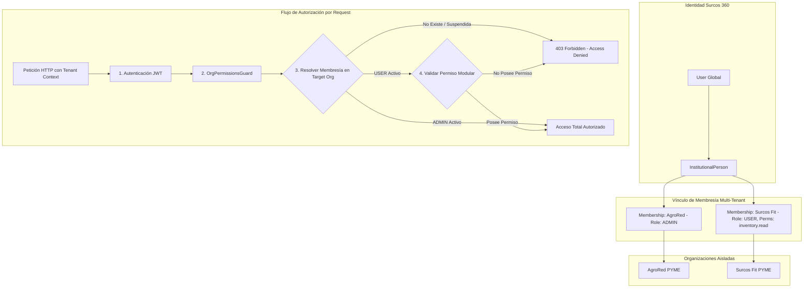
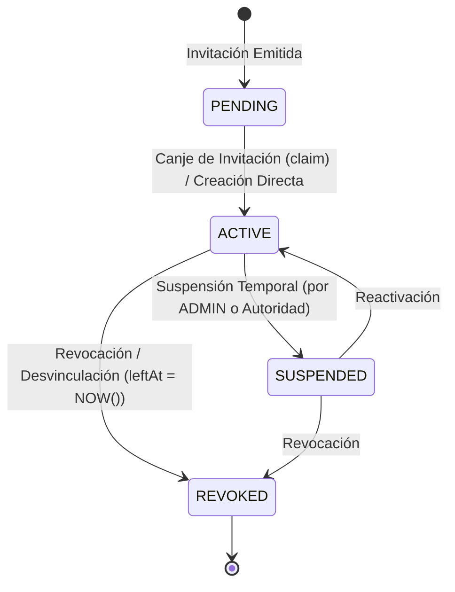

# Módulo de Membresías (`/memberships`)

## 1. Resumen Ejecutivo y Bounded Context

El módulo `/memberships` materializa el vínculo explícito entre una identidad global de **Surcos 360** (`InstitutionalPerson` / `User`) y una organización o PYME (`Organization`). Controla el ciclo de vida del miembro, roles organizacionales (`ADMIN`, `USER`), matriz de permisos granulares por módulo, tokens de invitación y aislamiento multi-tenant.

Fuente de Verdad Funcional: [surcos-360-prd-v1.md](../../../surcos-360-prd-v1.md) (§3.1, §4, §5, §6, §12, §13, §14, §17, §18, §19).

---

## 2. Diagrama de Relación y Autorización

---

## 3. Ciclo de Vida de la Membresía (`MembershipStatus`)

### Reglas de Estado
* `ACTIVE`: El miembro puede ejecutar acciones permitidas según su rol y permisos.
* `SUSPENDED`: Acceso bloqueado de inmediato en todas las capas (`403 Forbidden`).
* `REVOKED`: Vínculo terminado con registro de fecha de salida (`leftAt`).
* **Preservación de Identidad:** La eliminación o revocación de una membresía **jamás elimina la cuenta de usuario ni la identidad institucional** en Surcos 360.

---

## 4. Endpoints de la API (`/memberships`)

### `POST /memberships/invitations/verify`
- **Público:** Sí (No requiere JWT)
- **Body:** `{ "token": "org_inv_..." }`
- **Descripción:** Valida la vigencia de un token de invitación sin consumirlo.

### `POST /memberships/invitations/claim`
- **Autorización:** `JwtAuthGuard`
- **Body:** `{ "token": "org_inv_..." }`
- **Descripción:** El usuario autenticado acepta la invitación; genera la membresía y consume el token de forma atómica.

### `POST /memberships/invitations/register`
- **Público:** Sí (No requiere JWT)
- **Body:** `{ "token": "...", "email": "...", "password": "...", "firstName": "...", "lastName": "..." }`
- **Descripción:** Registro de un nuevo usuario institucional con vinculación inmediata de membresía a la PYME.

### `GET /memberships`
- **Autorización:** `Roles(UserType.AUTHORITY)`
- **Descripción:** Consulta administrativa global de membresías en toda la institución.

### `GET /memberships/me`
- **Autorización:** `JwtAuthGuard`
- **Descripción:** Retorna el listado de membresías activas del usuario autenticado.

### `POST /memberships/direct`
- **Autorización:** `RequirePermissions('members.manage')` o `OrgRoles(ADMIN)`
- **Query / Body:** `{ "organizationId": "...", "institutionalPersonId": "...", "role": "USER", "permissions": [...] }`
- **Descripción:** Asignación directa de un miembro preexistente a una organización.

### `GET /memberships/:id`
- **Autorización:** `JwtAuthGuard`
- **Descripción:** Consulta el detalle y perfil institucional de un miembro específico.

### `PATCH /memberships/:id/permissions`
- **Autorización:** `RequirePermissions('members.manage')` o `OrgRoles(ADMIN)`
- **Body:** `{ "permissions": ["inventory.read", "sales.create"] }`
- **Descripción:** Actualiza la matriz granular de permisos de un miembro con rol `USER`.

### `PATCH /memberships/:id/status`
- **Autorización:** `RequirePermissions('members.manage')` o `OrgRoles(ADMIN)`
- **Body:** `{ "status": "SUSPENDED" | "ACTIVE" | "REVOKED", "reason": "..." }`
- **Descripción:** Modifica el estado del ciclo de vida del miembro (protegido contra auto-bloqueo del único `ADMIN`).

### `DELETE /memberships/:id`
- **Autorización:** `RequirePermissions('members.manage')` o `OrgRoles(ADMIN)`
- **Descripción:** Elimina/desvincula la membresía del miembro (prohibido para el único `ADMIN`).
