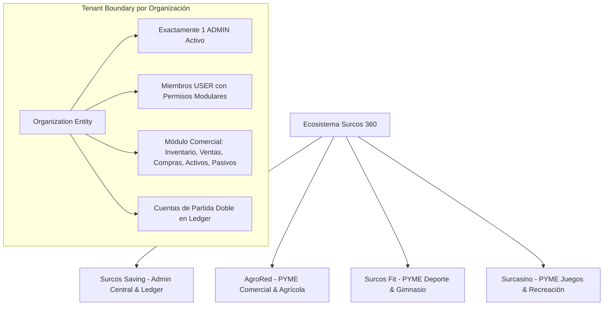
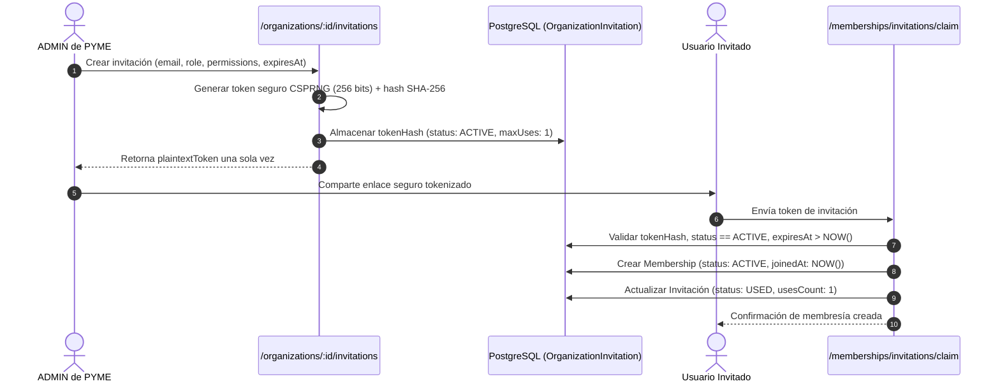

# Módulo de Organizaciones y PYMES (`/organizations`)

## 1. Resumen Ejecutivo y Bounded Context

El módulo `/organizations` es el núcleo de gobernanza multi-tenant de **Surcos 360**. Define los límites de aislamiento de datos (*Tenant Boundaries*), la configuración patrimonial y contable de las PYMES escolares (**AgroRed**, **Surcos Fit**, **Surcasino**) y la administración central (**Surcos Saving**).

Fuente de Verdad Funcional: [surcos-360-prd-v1.md](../../../surcos-360-prd-v1.md) (§4, §5, §7, §8, §9, §11).

---

## 2. Arquitectura de Dominio y Multi-Tenancy



### Regla Fundamental de Desacoplamiento
> **Un usuario pertenece a Surcos 360 como identidad global única. La pertenencia a una PYME existe únicamente mediante la entidad intermedia `Membership`.**

```text
User ≠ Organization Member
User ──> Membership ──> Organization
```

---

## 3. Modelo de Roles y Protección de Liderazgo

1. **Exactamente un `ADMIN` activo por PYME (§4.2 PRD v1.0):**
   - El Administrador es el líder operativo de la PYME.
   - **Separación de poderes:** El rol de `ADMIN` de una PYME es estrictamente local y **no otorga privilegios de autoridad global**. Las autoridades institucionales (`UserType.AUTHORITY`) operan a nivel de plataforma desde Surcos Saving.
2. **Protección contra Inconsistencias de Liderazgo (§19 PRD v1.0):**
   - **No duplicidad:** Se rechaza la creación o asignación de un segundo `ADMIN` en la misma PYME.
   - **No degradación accidental:** Se prohíbe suspender o eliminar al único `ADMIN` activo sin transferir previamente el rol de administración.
   - **Transferencia Atómica (`transfer-admin`):** El traspaso de liderazgo se ejecuta dentro de una transacción ACID (`$transaction`), degradando al administrador previo a `USER` y promoviendo al nuevo miembro a `ADMIN`.

---

## 4. Lifecycle de Invitaciones Criptográficas (`OrganizationInvitation`)



---

## 5. Matriz de Permisos Granulares (§5.2 PRD v1.0)

| Recurso | Permiso | Descripción |
| :--- | :--- | :--- |
| **Inventario** | `inventory.read` | Visualizar catálogo y existencias |
| | `inventory.create` | Crear nuevos ítems en almacén |
| | `inventory.update` | Modificar parámetros de stock y productos |
| | `inventory.adjust` | Ajustes manuales por merma o rotura |
| **Ventas** | `sales.read` | Consultar comprobantes e histórico de ventas |
| | `sales.create` | Registrar ventas POS de bienes, servicios o activos |
| | `sales.cancel` | Anular ventas con reversión en ledger e inventario |
| **Compras** | `purchases.read` | Consultar adquisiciones y cuentas por pagar |
| | `purchases.create` | Registrar compras con actualización WAC |
| | `purchases.update` | Modificar condiciones o recepciones |
| **Proveedores** | `suppliers.read` | Consultar directorio comercial |
| | `suppliers.manage` | Crear y editar proveedores |
| **Activos** | `assets.read` | Visualizar activos patrimoniales |
| | `assets.manage` | Altas, bajas y mantenimiento |
| | `assets.sell` | Autorizar y ejecutar venta de activo |
| **Pasivos** | `liabilities.read` | Consultar obligaciones financieras |
| | `liabilities.manage` | Registrar deudas y pagos |
| **Gastos** | `expenses.create` | Registrar egresos operativos |
| | `expenses.read` | Consultar histórico de gastos |
| **Reportes** | `reports.read` | Acceder a balances y estados financieros |
| **Miembros** | `members.read` | Consultar directorio de miembros |
| | `members.invite` | Emitir invitaciones criptográficas |
| | `members.manage` | Asignar roles, permisos y revocar |
| **Organización** | `organization.read` | Consultar perfil y configuración |
| | `organization.update` | Actualizar configuración operativa |

---

## 6. Endpoints de la API (`/organizations`)

### `POST /organizations`
- **Autorización:** `Roles(UserType.AUTHORITY)`
- **Descripción:** Crea una nueva organización en la plataforma con estado `ACTIVE`.

### `GET /organizations`
- **Autorización:** `JwtAuthGuard`
- **Query Params:** `status`, `isPyme`, `search`, `page`, `limit`
- **Descripción:** Lista organizaciones con paginación y conteo de miembros y productos.

### `GET /organizations/my-organizations`
- **Autorización:** `JwtAuthGuard`
- **Descripción:** Lista todas las organizaciones donde el usuario autenticado mantiene membresías activas.

### `GET /organizations/:id`
- **Autorización:** `JwtAuthGuard`
- **Descripción:** Consulta el detalle completo de una organización por UUID o código único (`AGRORED`, `FIT`, `SURCASINO`, `SAVING`).

### `PATCH /organizations/:id`
- **Autorización:** `RequirePermissions('organization.update')` o `OrgRoles(ADMIN)`
- **Descripción:** Actualiza metadatos y configuración de la organización.

### `PATCH /organizations/:id/status`
- **Autorización:** `Roles(UserType.AUTHORITY)`
- **Descripción:** Modifica el estado de la organización (`ACTIVE`, `INACTIVE`, `SUSPENDED`).

### `POST /organizations/:id/transfer-admin`
- **Autorización:** `OrgRoles(ADMIN)` o `Roles(UserType.AUTHORITY)`
- **Descripción:** Traspaso atómico del rol `ADMIN` a otro miembro activo de la PYME.

### `GET /organizations/:id/members`
- **Autorización:** `RequirePermissions('members.read')` o `OrgRoles(ADMIN)`
- **Descripción:** Lista los miembros de la organización con filtros por rol y estado.

### `POST /organizations/:id/members`
- **Autorización:** `RequirePermissions('members.manage')` o `OrgRoles(ADMIN)`
- **Descripción:** Incorporación directa de un usuario institucional como miembro.

### `POST /organizations/:id/invitations`
- **Autorización:** `RequirePermissions('members.invite')` o `OrgRoles(ADMIN)`
- **Descripción:** Emite una invitación segura tokenizada (256 bits CSPRNG).

### `GET /organizations/:id/invitations`
- **Autorización:** `RequirePermissions('members.read')` o `OrgRoles(ADMIN)`
- **Descripción:** Consulta el registro de invitaciones activas e históricas de la organización.

### `DELETE /organizations/:id/invitations/:invitationId`
- **Autorización:** `RequirePermissions('members.manage')` o `OrgRoles(ADMIN)`
- **Descripción:** Revoca una invitación activa para impedir su canje.
