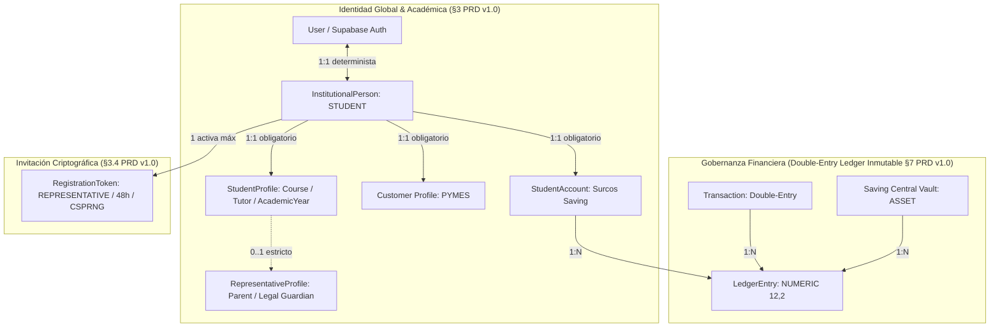
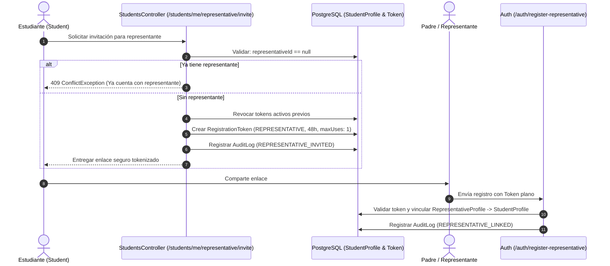

# Students & Academic Domain Module (`/students`) — Surcos 360

## 1. Arquitectura y Visión General

El módulo `/students` es el núcleo de identidad académica, autogestión y gobernanza financiera estudiantil de **Surcos 360**, alineado estrictamente con el **PRD v1.0 (§3, §6, §7, §12 y §13)**.

El módulo desacopla limpiamente la identidad global de usuario (`User` en Supabase Auth), la persona institucional (`InstitutionalPerson`), el expediente académico (`StudentProfile`), el perfil comercial (`Customer`), la cuenta financiera en Surcos Saving (`StudentAccount`) vinculada al libro mayor de partida doble (*Double-Entry General Ledger*), y la relación unívoca con el representante legal (`RepresentativeProfile`).



---

## 2. Responsabilidades y Bounded Contexts

El módulo `/students` gestiona exclusivamente el **dominio estudiantil** y no absorbe responsabilidades de otros bounded contexts:

* **Autenticación y Credenciales:** Delegadas a `/auth` (Supabase Auth / JWT). No se almacenan contraseñas en Student.
* **Perfil de Usuario Global:** Gestionado en `/users`.
* **Membresías de PYMES:** Gestionadas en `/organizations` y `/memberships`.
* **Cálculo Financiero y Movimientos:** Delegados al motor contable inmutable `/ledger` y `/saving`.
* **Auditoría Inmutable:** Cada mutación emite eventos sincrónicos en `AuditLog`.

---

## 3. Sub-Servicios Modulares

La arquitectura de `/students` está dividida en 4 servicios altamente cohesivos y desacoplados:

1. **`StudentsService` (`src/students/services/students.service.ts`):**
   * Creación atómica e individual de estudiantes (`createStudent`).
   * Consulta paginada y filtrada con aislamiento multi-tenant (`findAll`).
   * Consulta detallada de estudiante (`findById`).
   * Consulta de perfil propio de autoservicio (`getStudentProfile`).
   * Actualización de datos personales y académicos (`updateStudent`, `updateAcademicData`).
   * Actualización de estado de la cuenta institucional (`updateStatus`).
   * Búsqueda en caja POS para ventas de PYMES (`lookupStudent`).

2. **`StudentAnalyticsService` (`src/students/services/student-analytics.service.ts`):**
   * Dashboard estudiantil minimalista sin barra lateral (`getStudentDashboard`).
   * Extracto de movimientos detallado y paginado con balance dinámico (`getStudentStatement`).
   * Estadísticas de gasto por PYME (AgroRed, Surcos Fit, Surcasino, Surcos Saving) y tendencias mensuales (`getStudentStatistics`).
   * Certificados y reportes financieros estructurados (`getStudentReport`).

3. **`StudentRepresentativeService` (`src/students/services/student-representative.service.ts`):**
   * Consulta de representante legal vinculado o invitación activa (`getStudentRepresentative`).
   * Generación de invitación criptográfica de 48h con regla estricta de un solo representante (`createRepresentativeInvitation`).
   * Desvinculación de representante con registro de auditoría (`unlinkRepresentative`).

4. **`StudentImportService` (`src/students/services/student-import.service.ts`):**
   * Importación masiva por lotes con deduplicación intra-lote y contra base de datos (`bulkImport`).
   * Creación atómica transaccional y reporte detallado por fila (`results`).

---

## 4. Reglas de Negocio y Seguridad Críticas

### 4.1 Regla de Un Solo Representante Legal (*One-Representative Invariant*)
Conforme al **PRD v1.0 (§3.4)**, un estudiante puede vincular **únicamente a un padre de familia o representante legal**.
* Si el estudiante ya tiene un representante vinculado (`studentProfile.representativeId !== null`), se bloquea la generación de nuevas invitaciones (`409 ConflictException`).
* Al generarse una nueva invitación, se revocan invitaciones anteriores activas para garantizar unicidad.
* En `/auth/register-representative`, se valida a nivel de base de datos y servidor que el estudiante no cuente con otro representante.



### 4.2 Restricciones del Estudiante y Seguridad en Tres Capas (§6.4 PRD v1.0)
Los estudiantes tienen prohibido taxativamente:
1. Crear ventas o emitir comprobantes comerciales.
2. Crear o actualizar productos, precios o inventarios.
3. Crear proveedores o registrar compras.
4. Modificar saldos directamente (no existe endpoint `PATCH /balance`).
5. Modificar asientos contables del libro mayor (*General Ledger*).
6. Consultar información personal o financiera de otros estudiantes (Ownership enforcement estricto en `/students/me/*`).

---

## 5. Matriz de Endpoints y Contratos de API

| Método | Endpoint | Roles / Scope | Descripción Funcional |
|---|---|---|---|
| `GET` | `/api/v1/students/me/dashboard` | `STUDENT`, `AUTHORITY`, `TEACHER` | Dashboard con saldo inicial, monto ahorrado, total gastos y actividad reciente (§6.2 PRD). |
| `GET` | `/api/v1/students/me/statement` | `STUDENT`, `AUTHORITY`, `TEACHER` | Historial paginado de movimientos con balance dinámico, resolución de PYME y filtros (§6.3 PRD). |
| `GET` | `/api/v1/students/me/statistics` | `STUDENT`, `AUTHORITY`, `TEACHER` | Estadísticas de consumo: desglose por PYME (%), promedios y tendencias mensuales. |
| `GET` | `/api/v1/students/me/reports/summary` | `STUDENT`, `AUTHORITY`, `TEACHER` | Certificado / reporte financiero estructurado para descarga o constancia oficial. |
| `GET` | `/api/v1/students/me/profile` | `STUDENT`, `AUTHORITY`, `TEACHER` | Perfil académico, datos del tutor y saldo en tiempo real. |
| `GET` | `/api/v1/students/me/representative` | `STUDENT`, `AUTHORITY`, `TEACHER` | Consulta del representante vinculado o estado de invitación pendiente. |
| `POST` | `/api/v1/students/me/representative/invite` | `STUDENT`, `AUTHORITY` | Generación de invitación criptográfica de un solo uso (48h de vigencia). |
| `GET` | `/api/v1/students/lookup` | `AUTHORITY`, `TEACHER` | Búsqueda de estudiante activo para cobro en POS por código institucional o correo. |
| `POST` | `/api/v1/students` | `AUTHORITY`, `TEACHER` | Registro individual atómico con apertura de cuenta y financiamiento inicial. |
| `POST` | `/api/v1/students/import` | `AUTHORITY` | Importación masiva por lote con deduplicación y reporte por fila. |
| `GET` | `/api/v1/students` | `AUTHORITY`, `TEACHER` | Listado general con paginación, ordenamiento y filtros multi-tenant. |
| `GET` | `/api/v1/students/:id` | `AUTHORITY`, `TEACHER` | Detalle completo de estudiante con relaciones académicas, comerciales y financieras. |
| `GET` | `/api/v1/students/:id/dashboard` | `AUTHORITY`, `TEACHER` | Vista de supervisión del dashboard de un estudiante. |
| `GET` | `/api/v1/students/:id/statement` | `AUTHORITY`, `TEACHER` | Vista de supervisión del extracto de movimientos de un estudiante. |
| `GET` | `/api/v1/students/:id/statistics` | `AUTHORITY`, `TEACHER` | Vista de supervisión de las estadísticas de un estudiante. |
| `GET` | `/api/v1/students/:id/reports/summary` | `AUTHORITY`, `TEACHER` | Generación de reporte financiero de supervisión. |
| `GET` | `/api/v1/students/:id/representative` | `AUTHORITY`, `TEACHER` | Consulta supervisora del representante legal. |
| `PATCH` | `/api/v1/students/:id` | `AUTHORITY`, `TEACHER` | Actualización de nombres, curso y tutor con auditoría. |
| `PATCH` | `/api/v1/students/:id/academic` | `AUTHORITY`, `TEACHER` | Actualización dedicada de curso, año lectivo y tutor (`ACADEMIC_DATA_UPDATED`). |
| `PATCH` | `/api/v1/students/:id/status` | `AUTHORITY` | Cambio de estado (`ACTIVE`, `INACTIVE`, `SUSPENDED`) con motivo. |
| `DELETE` | `/api/v1/students/:id/representative` | `AUTHORITY` | Desvinculación de representante legal (`REPRESENTATIVE_UNLINKED`). |

---

## 6. Eventos de Auditoría Registrados

Todas las mutaciones críticas emiten sincrónicamente un registro inmutable en `AuditLog`:

* `STUDENT_CREATED`: Creación de identidad estudiantil, perfil, cliente y cuenta.
* `STUDENT_UPDATED`: Modificación de datos generales del estudiante.
* `ACADEMIC_DATA_UPDATED`: Cambio de curso, paralelo, año lectivo o tutor asignado.
* `STUDENT_STATUS_UPDATED`: Suspensión o reactivación institucional.
* `STUDENT_IMPORTED`: Lote de importación masiva procesado.
* `STUDENT_LINKED`: Vinculación determinista de identidad pre-importada con usuario de autenticación.
* `REPRESENTATIVE_INVITED`: Generación de token criptográfico de invitación para padre de familia.
* `REPRESENTATIVE_LINKED`: Canje de invitación y vinculación del representante.
* `REPRESENTATIVE_UNLINKED` / `STUDENT_UNLINKED`: Revocación del vínculo entre estudiante y representante.

---

## 7. Testing y Verificación

El módulo cuenta con cobertura total a través de pruebas unitarias, de integración y E2E:

```bash
# Ejecutar pruebas unitarias del módulo
npm test -- src/students

# Ejecutar pruebas E2E y de seguridad
npm run test:e2e -- test/students.e2e-spec.ts
```
