# Surcos 360 — PRD v1.0

**Estado:** Documento Oficial de Definición de Producto (Única Fuente de Verdad)  
**Plataforma:** Web Responsive (Next.js · NestJS · PostgreSQL · Supabase · Prisma · pgvector)  
**Clasificación:** Plataforma Integral Empresarial, Financiera y Educativa  

---

## 1. Resumen Ejecutivo

**Surcos 360** es la plataforma enterprise integral diseñada para unificar, gobernar y optimizar el ecosistema empresarial, financiero y educativo de la Unidad Educativa Surcos. La plataforma centraliza la gestión de identidades institucionales, operaciones comerciales de pequeñas y medianas empresas escolares (PYMES), contabilidad financiera con garantía matemática de partida doble, auditoría inmutable en tiempo real y asistencia basada en Inteligencia Artificial contextualizada con retrieval-augmented generation (RAG).

El ecosistema integra cuatro organizaciones activas con modelos operativos específicos y capacidades comerciales completas:

1. **Surcos Saving:** Organización financiera y de administración central del ecosistema. Opera el libro contable mayor (*ledger* inmutable), custodia las cuentas de ahorro estudiantil, consolida la analítica operativa de las PYMES y provee las herramientas de gobernanza global a las autoridades institucionales.
2. **AgroRed:** PYME de producción, acopio y comercialización de productos agrícolas y comestibles.
3. **Surcos Fit:** PYME prestadora de servicios de acondicionamiento físico y salud deportiva (gestión de membresías, control de visitas libres y pagadas, e inventario deportivo).
4. **Surcasino:** PYME de entretenimiento y desarrollo lúdico escolar especializada en el alquiler de material recreativo y juegos de mesa (Jenga, ajedrez, tenis de mesa, balones y juegos recreativos), con venta de activos y productos afines.

La plataforma opera bajo un modelo de **monolito modular desacoplado** preparado para evolución enterprise, garantizando aislamiento estricto entre organizaciones (*tenant isolation*), defensa en profundidad y cumplimiento normativo estricto para protección de datos de menores de edad (LOPDP Ecuador).

---

## 2. Declaración del Problema y Objetivos

### 2.1 Contexto y Problemática

Previo a Surcos 360, las operaciones de las iniciativas productivas escolares y el registro de la economía estudiantil se ejecutaban de forma fragmentada mediante hojas de cálculo, registros en papel y canales informales. Esta dispersión generaba los siguientes problemas críticos:

* **Inconsistencia y Opacidad Financiera:** Imposibilidad de conciliar en tiempo real el saldo de ahorro de los estudiantes frente a los consumos realizados en las distintas PYMES.
* **Falta de Trazabilidad e Integridad:** Ausencia de pistas de auditoría que identifiquen al autor material de cada movimiento de stock, cambio de precios o egreso monetario.
* **Mezcla Indiscriminada de Conceptos Contables:** Confusión operativa entre inventario circulante, activos fijos patrimoniales y pasivos (deudas con proveedores).
* **Vulnerabilidades de Acceso:** Inexistencia de un esquema formal de permisos por módulo, permitiendo manipulaciones no autorizadas en registros de compras y ventas.

### 2.2 Objetivos del Producto

#### 2.2.1 Objetivo General
Proveer una plataforma web enterprise centralizada, resiliente y segura que estandarice la gestión de identidad, automatice el ciclo comercial de las PYMES escolares, asegure la inmutabilidad de los fondos estudiantiles y ofrezca analítica inteligente a toda la comunidad educativa.

#### 2.2.2 Objetivos Específicos
* **Identidad Institucional Segura:** Implementar un registro cerrado para la comunidad educativa (`@colegiosurcos.edu.ec`) con detección determinística de perfiles y un mecanismo seguro de vinculación por invitación criptográfica para representantes legales.
* **Gobernanza Organizacional Simplificada:** Establecer un modelo de membresía unívoco (`ADMIN` / `USER`) con matriz de permisos granulares por módulo (`inventory`, `sales`, `purchases`, `reports`, `assets`, `liabilities`).
* **Motor Financiero Robusto:** Implementar un libro contable mayor de partida doble (*Double-Entry General Ledger*) donde cada transacción comercial y movimiento de ahorro se registre con balance exacto entre débitos y créditos (`SUM(Debits) = SUM(Credits)`), garantizando idempotencia y cero errores de redondeo mediante tipos numéricos exactos.
* **Autonomía Comercial de PYMES:** Habilitar a todas las organizaciones para gestionar inventarios, activos, pasivos, proveedores, compras y ventas (de bienes, servicios o activos amortizados) calculando automáticamente el costo de ventas (COGS) mediante Costo Promedio Ponderado (*Weighted Average Cost* - WAC) con bloqueos de concurrencia.
* **Experiencia Estudiantil Focalizada:** Ofrecer a los estudiantes un portal de autoservicio minimalista, sin barra lateral (*sidebar*), enfocado en la consulta de saldo, desglose de actividad y analítica de consumo personal, bloqueando cualquier mutación comercial a través de tres capas de seguridad.
* **Inteligencia Artificial Segura y Gobernada:** Habilitar un asistente analítico contextualizado (Gemini + RAG con pgvector) que ejecute herramientas de base de datos bajo el contexto de seguridad y permisos del usuario consultante, prohibiendo la ejecución de SQL libre.

---

## 3. Modelo Fundamental de Identidad

### 3.1 Principio Rector de Identidad

> **Un usuario pertenece a Surcos 360 como identidad global única. La existencia de un usuario en Surcos 360 no le otorga membresía automática ni privilegios operativos en ninguna PYME.**

La identidad institucional y las relaciones comerciales u operativas se encuentran estrictamente desacopladas:

```text
Surcos 360 Identity ≠ Organization Membership ≠ Commercial Customer ≠ Commercial Supplier ≠ Permission Set
```

Una misma persona física mantiene una única identidad global en la plataforma y puede asumir roles contextuales simultáneos sin duplicación de registros:

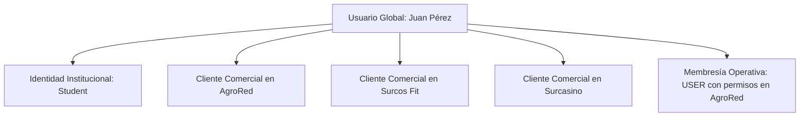

### 3.2 Diagrama de Dominio de Identidad

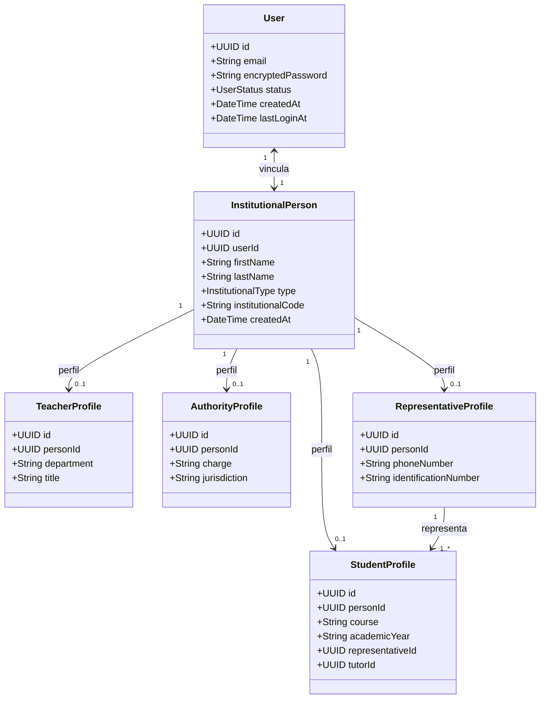

### 3.3 Reglas de Registro y Autenticación Institucional

#### 3.3.1 Dominio Institucional Obligatorio
El endpoint `/auth/register` institucional aplica una restricción estricta de validación a nivel de servidor:

* **Único Dominio Permitido:** `@colegiosurcos.edu.ec`
* **Dominios Prohibidos:** Cualquier proveedor externo (`@gmail.com`, `@outlook.com`, `@yahoo.com`, etc.) o dominio no reconocido es rechazado con error `400 Bad Request (INVALID_INSTITUTIONAL_DOMAIN)`.

#### 3.3.2 Identificación Determinística de Estudiantes
La clasificación del tipo de usuario institucional se valida en el backend mediante el patrón estándar de correo electrónico:

$$\text{Regla de Correo Estudiantil: } \texttt{`\textless identifier\textgreater\_est@colegiosurcos.edu.ec`}$$

* Si el correo satisface la expresión regular `^[a-zA-Z0-9._%+-]+_est@colegiosurcos\.edu\.ec$`:
  * Se asigna automáticamente la identidad `InstitutionalType.STUDENT`.
  * Se requiere la captura del campo `course` (ej. `3ro BGU "A"`).
  * Se genera automáticamente su cuenta financiera `StudentAccount` en Surcos Saving vinculada a su identidad.
* Si el correo institucional no posee el sufijo `_est` (ej. `m.gonzalez@colegiosurcos.edu.ec`):
  * Se clasifica como `Teacher` o `Authority` según la validación de registros institucionales preexistentes.
  * **Nomenclatura Oficial:** Se utiliza exclusivamente `Teacher` (Maestro) y `Authority` (Autoridad).

### 3.4 Registro de Padres de Familia y Representantes Legales

Los representantes legales no poseen correo institucional y se incorporan al sistema mediante un flujo de invitación criptográfica segura generado exclusivamente por el estudiante desde su panel.

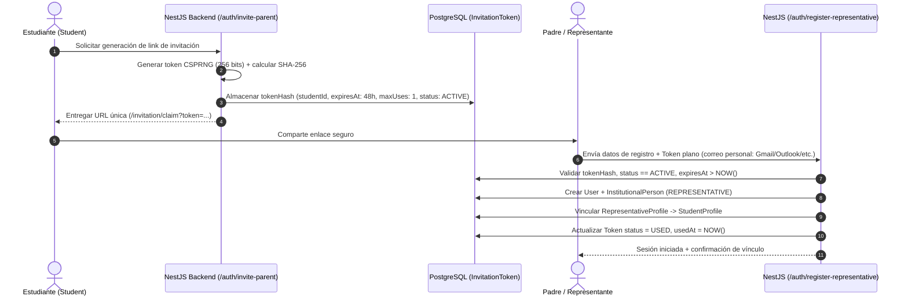

#### 3.4.1 Requisitos de Seguridad del Token de Invitación (`InvitationToken`)
1. **Entropía Criptográfica:** Generado mediante `crypto.randomBytes(32)` (256 bits de entropía).
2. **Almacenamiento Seguro:** El token plano nunca se persiste en la base de datos; solo se almacena su resumen criptográfico unidireccional `tokenHash` calculado con `SHA-256`.
3. **Uso Único Estricto:** Restricción de base de datos con `maxUses = 1`. Al completarse el registro, la fila pasa a estado `USED` de forma atómica.
4. **Expiración Temporal:** Vigencia máxima de 48 horas desde su emisión.
5. **Aislamiento de Vínculo:** La relación `Representative -> Student` se deriva exclusivamente del `studentId` firmado en los metadatos del token validado, impidiendo cualquier reasignación cruzada maliciosa o accidental hacia otro estudiante.
6. **Mitigación de Ataques:** Rate limiting estricto por IP y por identificador en el endpoint de canje (máximo 5 intentos por minuto) para prevenir fuerza bruta.

---

## 4. Modelo Organizacional y Membresías de PYMES

### 4.1 Estructura de Organizaciones

El ecosistema Surcos 360 está compuesto por organizaciones independientes. Cada PYME opera como una entidad contable y operativa aislada:

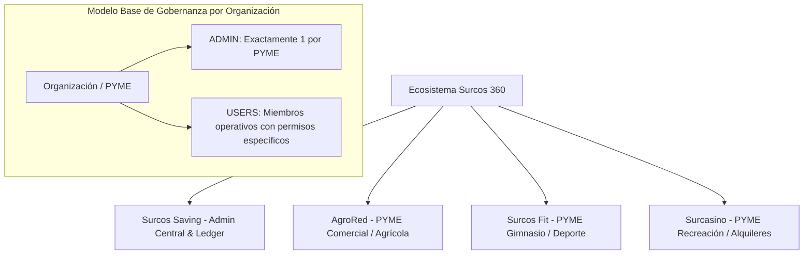

### 4.2 Modelo de Roles Simplificado

Para evitar sobrecarga jerárquica innecesaria, cada PYME implementa un modelo de membresía directo y consistente:

* **ADMIN (Administrador de PYME):** Existe **exactamente un ADMIN activo** por organización. Es el responsable máximo de la gestión de la PYME ante la institución.
* **USER (Miembro de PYME):** Todo miembro operativo adicional de la organización posee el rol base `USER`. Su capacidad de ejecución dentro del sistema está delimitada exclusivamente por la matriz de permisos por módulo asignada por el `ADMIN`.

> **Separación de Poderes:** El rol de `ADMIN` de una PYME es estrictamente local a dicha organización y **no confiere privilegios administrativos globales** sobre el ecosistema Surcos 360 ni sobre otras organizaciones.

### 4.3 Capacidades del ADMIN de PYME

El `ADMIN` de una PYME tiene las siguientes facultades dentro de su organización:
* Invitar nuevos miembros y revocar membresías activas.
* Asignar y revocar permisos modulares a los usuarios con rol `USER`.
* Habilitar o restringir módulos de operación de la PYME (inventario, compras, ventas, activos, pasivos, gastos).
* Configurar parámetros operativos de la organización (almacenes, políticas de precios, catálogo).
* Consultar la totalidad de reportes comerciales, estados financieros locales y auditoría de su PYME.

---

## 5. Sistema de Autorización y Permisos Granulares

### 5.1 Niveles de Permisos

El sistema implementa dos alcances de autorización formalmente separados:

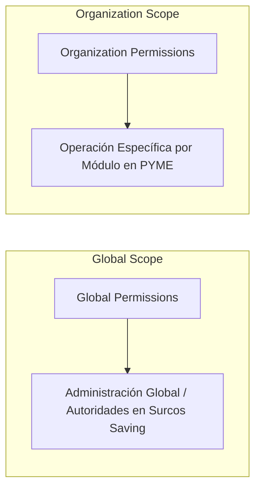

1. **Global Permissions:** Otorgados a identidades institucionales de nivel directivo (Autoridades) para la gobernanza global del ecosistema desde Surcos Saving.
2. **Organization Permissions:** Otorgados a miembros de una PYME (`ADMIN` o `USER`) para operar recursos dentro del contexto de esa organización específica.

### 5.2 Matriz de Permisos por Módulo de Negocio

Los permisos siguen el formato estándar `<recurso>.<acción>` y se validan en cada endpoint del backend:

| Módulo | Permiso Granular | Descripción Funcional |
| :--- | :--- | :--- |
| **Inventario** | `inventory.read` | Visualizar catálogo de productos, existencias y movimientos. |
| | `inventory.create` | Registrar nuevos ítems o productos en los almacenes. |
| | `inventory.update` | Modificar atributos de productos y parámetros de stock. |
| | `inventory.adjust` | Ejecutar ajustes manuales de stock por merma, rotura o pérdida. |
| **Ventas** | `sales.read` | Consultar histórico de ventas y comprobantes emitidos. |
| | `sales.create` | Registrar ventas de inventario, servicios o activos. |
| | `sales.cancel` | Anular transacciones de venta con reversión en ledger e inventario. |
| **Compras** | `purchases.read` | Consultar compras realizadas a proveedores y cuentas por pagar. |
| | `purchases.create` | Registrar adquisiciones de inventario o activos a proveedores. |
| | `purchases.update` | Actualizar condiciones de compra o recepciones de mercadería. |
| **Proveedores** | `suppliers.read` | Consultar directorio de proveedores comerciales. |
| | `suppliers.manage` | Crear, editar y suspender perfiles de proveedores. |
| **Activos** | `assets.read` | Visualizar catálogo y estado de activos fijos patrimoniales. |
| | `assets.manage` | Registrar altas, transferencias, mantenimiento o bajas de activos. |
| | `assets.sell` | Autorizar y ejecutar la venta de un activo patrimonial. |
| **Pasivos** | `liabilities.read` | Consultar obligaciones financieras y cuentas por pagar. |
| | `liabilities.manage` | Registrar obligaciones y amortizaciones o pagos a pasivos. |
| **Gastos** | `expenses.create` | Registrar egresos y gastos operativos de la PYME. |
| | `expenses.read` | Consultar histórico y consolidado de gastos. |
| **Reportes** | `reports.read` | Acceder a balances, estado de resultados y analítica de la PYME. |
| **Miembros** | `members.manage` | Asignar roles, invitar o revocar permisos a miembros de la PYME. |

---

## 6. Módulo de Estudiantes y Experiencia de Usuario

### 6.1 Principio de Navegación del Estudiante

El estudiante cuenta con una interfaz de autoservicio deliberadamente minimalista y orientada a la educación financiera personal.

* **Sin Barra Lateral (No-Sidebar Navigation):** La interfaz del estudiante prescinde por completo de barras laterales de navegación. La estructura se organiza mediante una barra superior (*Header Bar*) limpia con acceso a perfil, saldo y pestañas de contenido directo.
* **Enfoque en Datos Propios:** La experiencia se centra exclusivamente en el estado de cuenta, desglose de actividad personal, estadísticas de ahorro y generación de constancias individuales.

### 6.2 Estructura del Dashboard Estudiantil

La pantalla principal del estudiante presenta de forma prominente su balance financiero y su actividad reciente:

```text
┌────────────────────────────────────────────────────────────────────────┐
│ Surcos 360                                      Hola, Juan Pérez ▾     │
├────────────────────────────────────────────────────────────────────────┤
│ Estudiante: Juan Pérez           Curso: 3ro BGU "A"                    │
│                                                                        │
│ ┌──────────────────────┬──────────────────────┬──────────────────────┐ │
│ │ Monto Inicial        │ Monto Ahorrado       │ Gastos Totales       │ │
│ │       $100.00        │        $75.00        │        $25.00        │ │
│ └──────────────────────┴──────────────────────┴──────────────────────┘ │
│                                                                        │
│ Actividad Reciente                                                     │
│ ┌────────────────────────────────────────────────────────────────────┐ │
│ │ AgroRed             Almuerzo nutritivo + Jugo natural      -$8.50  │ │
│ │ Surcos Fit          Pase diario de entrenamiento           -$5.00  │ │
│ │ Surcasino           Alquiler Jenga gigante (1 hora)        -$3.00  │ │
│ └────────────────────────────────────────────────────────────────────┘ │
│                                             [ Ver más actividad → ]    │
└────────────────────────────────────────────────────────────────────────┘
```

### 6.3 Pantalla de Detalle de Actividad

Al pulsar sobre `Ver más`, el estudiante accede a una vista tabular completa con el registro granular de todas sus transacciones:

| Fecha / Hora | Organización / PYME | Concepto | Tipo Operación | Monto | Saldo Resultante | Referencia | Estado |
| :--- | :--- | :--- | :--- | :--- | :--- | :--- | :--- |
| 15/08/2026 11:30 | AgroRed | Almuerzo + Bebida | Consumo / Compra | -$8.50 | $75.00 | TX-00984 | `COMPLETED` |
| 14/08/2026 15:10 | Surcos Fit | Visita Libre Gimnasio | Acceso | $0.00 | $83.50 | VST-00312 | `COMPLETED` |
| 12/08/2026 10:00 | Surcasino | Alquiler Jenga 1h | Alquiler Recreativo | -$3.00 | $83.50 | RNT-00120 | `COMPLETED` |
| 10/08/2026 08:30 | Surcos Saving | Depósito Fondo Inicial | Aporte de Ahorro | +$100.00 | $100.00 | TX-00001 | `COMPLETED` |

### 6.4 Restricciones del Estudiante y Seguridad en Tres Capas

Los estudiantes tienen prohibido taxativamente ejecutar cualquier acción que altere el estado comercial o financiero de terceros. La plataforma aplica estas restricciones en **tres capas independientes de seguridad**:

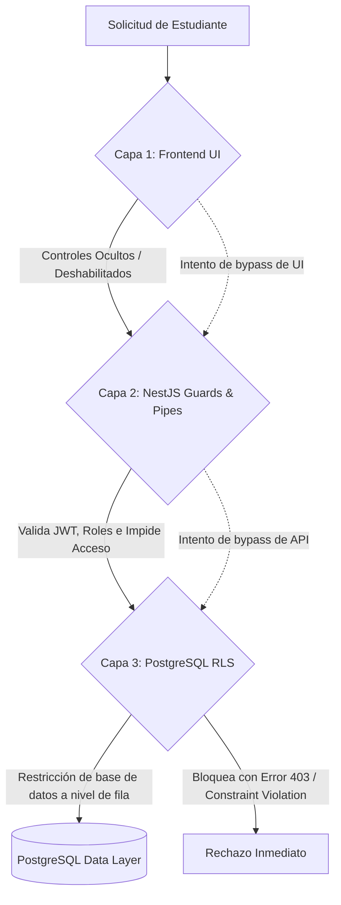

**Restricciones Auditadas y Forzadas:**
1. No puede registrar ventas ni emitir órdenes de cobro.
2. No puede registrar compras de insumos ni adquisiciones de activos.
3. No puede modificar inventarios, cantidades ni listas de precios.
4. No puede crear productos, categorías ni fichas de proveedores.
5. No puede registrar alquileres ni manipular el estado de los juegos.
6. No puede consultar saldos, datos personales ni movimientos financieros de otros usuarios.
7. No puede alterar los registros contables del *ledger* bajo ninguna circunstancia.

---

## 7. Surcos Saving y Motor Contable Central

### 7.1 Rol de Surcos Saving

**Surcos Saving** es la entidad financiera y de control central del ecosistema. Sus funciones principales incluyen:
* Custodia y emisión de las cuentas de ahorro estudiantil (`StudentAccount`).
* Operación del libro contable general de partida doble (*General Ledger*).
* Consolidación de balances y estados de resultados de todas las PYMES.
* Punto de acceso administrativo para las Autoridades Institucionales.

### 7.2 Autoridades en Surcos Saving

Las autoridades del plantel (Rectorado, Vicerrectorado, Dirección Financiera) se integran a la plataforma como identidades institucionales de tipo `Authority` y poseen membresía con rol `ADMIN` en la organización **Surcos Saving**.

Esto les confiere capacidades para:
* Consultar métricas financieras agregadas y desglosadas por PYME.
* Supervisar la liquidez total del fondo de ahorro y la actividad de los estudiantes.
* Auditar el cumplimiento contable y el inventario patrimonial del colegio.
* Utilizar herramientas avanzadas de reportería e Inteligencia Artificial administrativa.

### 7.3 Motor Contable de Partida Doble (*Double-Entry General Ledger*)

Para asegurar la consistencia matemática inmutable y prevenir inconsistencias en el saldo, todo hecho económico se modela como una **Transacción Contable (`Transaction`)** compuesta obligatoriamente por dos o más **Asientos Contables (`LedgerEntry`)** debidamente balanceados:

$$\sum \text{Débitos} = \sum \text{Créditos}$$

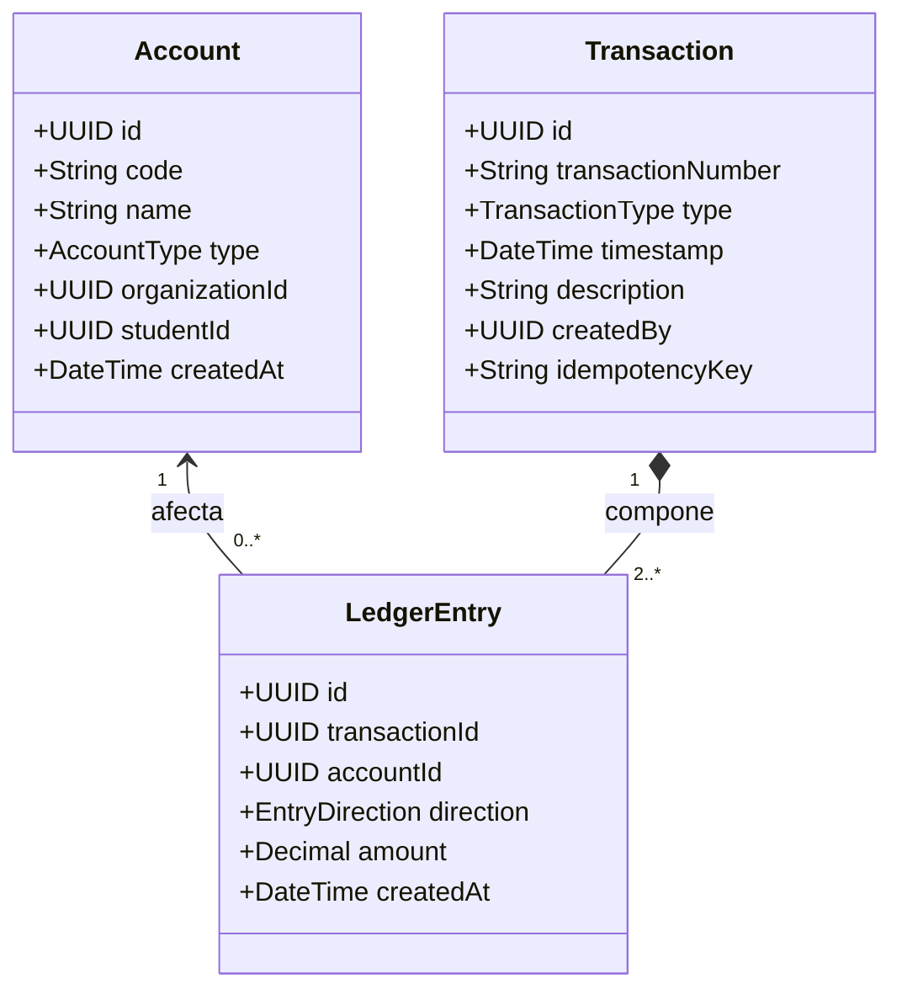

#### 7.3.1 Reglas Contables Fundamentales
1. **Precisión Numérica Exacta:** Todos los montos monetarios se almacenan como `NUMERIC(12, 2)` en PostgreSQL. Se prohíbe el uso de tipos de coma flotante (`FLOAT`, `DOUBLE`) para evitar errores de redondeo acumulado.
2. **Naturaleza Inmutable (Append-Only):** Los registros de `Transaction` y `LedgerEntry` son de solo inserción (*append-only*). Se prohíben operaciones de `UPDATE` o `DELETE` a nivel de base de datos. Cualquier ajuste o corrección se realiza mediante una nueva transacción de reversión o asiento de ajuste.
3. **Idempotencia de Operaciones:** Cada solicitud que mute el estado financiero debe incluir una cabecera `Idempotency-Key`. Si el servidor recibe una clave repetida dentro de su ventana de validez, retorna la respuesta cacheada sin duplicar los asientos contables.
4. **Transaccionalidad Atómica (ACID):** Toda operación comercial (venta, compra, consumo) agrupa la creación de la venta, el movimiento de inventario físico, los asientos del ledger y la pista de auditoría dentro de una única transacción de base de datos (`$transaction` en Prisma). Ante cualquier error, se ejecuta un `ROLLBACK` total.

#### 7.3.2 Ejemplo de Registro de Partida Doble
Consumo de un estudiante por $8.50 en la PYME AgroRed:

```text
Transacción: TX-00984 (Compra en AgroRed)
├── DEBIT   Cuenta de Ahorro Estudiante (Juan Pérez)    $8.50  (Disminución de Pasivo/Ahorro)
└── CREDIT  Ingresos Operativos por Ventas (AgroRed)    $8.50  (Aumento de Ingresos)
```

---

## 8. Módulo Empresarial Común para PYMES

Todas las organizaciones del ecosistema disponen de una base funcional empresarial compartida, asegurando procesos estandarizados de control patrimonial, comercial y operativo.

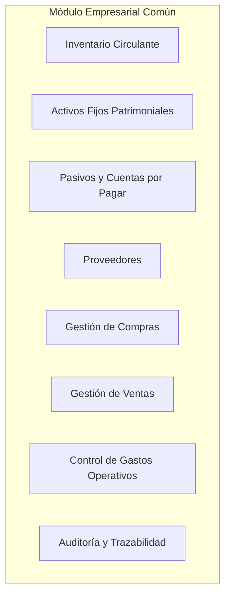

### 8.1 Separación Estricta: Inventario vs. Activos vs. Pasivos

La arquitectura diferencia conceptual y técnicamente estos tres elementos patrimoniales:

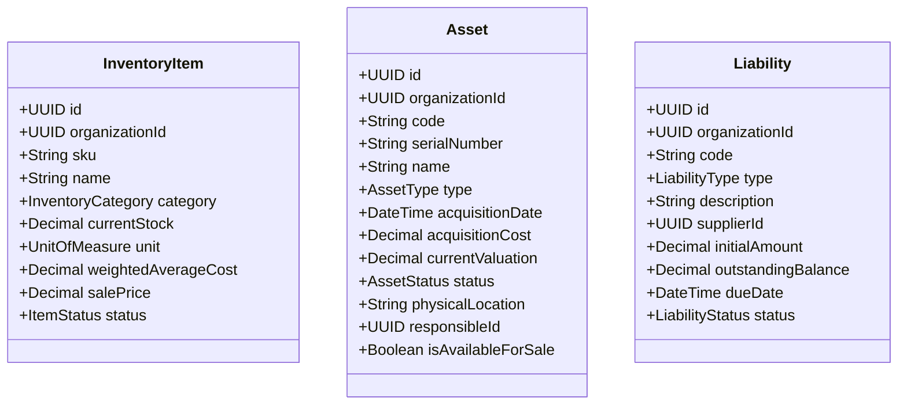

* **Inventario (`InventoryItem`):** Bienes destinados a la comercialización regular o insumos para transformación y consumo operativo inmediato (ej. snacks, hortalizas, bebidas). Su valoración se gestiona mediante stock cuantitativo y Costo Promedio Ponderado.
* **Activos (`Asset`):** Bienes de valor patrimonial y uso prolongado propiedad de la organización (equipos, máquinas, mobiliario, implementos deportivos, juegos de mesa, computadores). Poseen identificación unívoca por código/serial, estado de conservación y responsable de custodia.
* **Pasivos (`Liability`):** Obligaciones financieras y compromisos de pago con terceros (facturas a crédito de proveedores, préstamos institucionales).

### 8.2 Exclusión Total de Impuestos en el Modelo Comercial

El modelo comercial de Surcos 360 **no contempla la aplicación de impuestos, retenciones ni tarifas tributarias (IVA = 0 / No aplica)**. Las operaciones comerciales se liquidan bajo la siguiente fórmula exacta:

$$\text{Total Transacción} = \text{Subtotal} - \text{Descuentos Aplicados}$$

Se elimina cualquier campo o cálculo referente a impuestos tanto en base de datos como en los contratos de la API.

### 8.3 Costeo por Costo Promedio Ponderado (WAC) y Concurrencia

Para todo producto comercializable, el costo de adquisición se actualiza automáticamente ante cada compra utilizando la fórmula de **Weighted Average Cost (WAC)**:

$$\text{Nuevo WAC} = \frac{(\text{Stock Previo} \times \text{WAC Previo}) + (\text{Cantidad Comprada} \times \text{Costo Unitario Compra})}{\text{Stock Previo} + \text{Cantidad Comprada}}$$

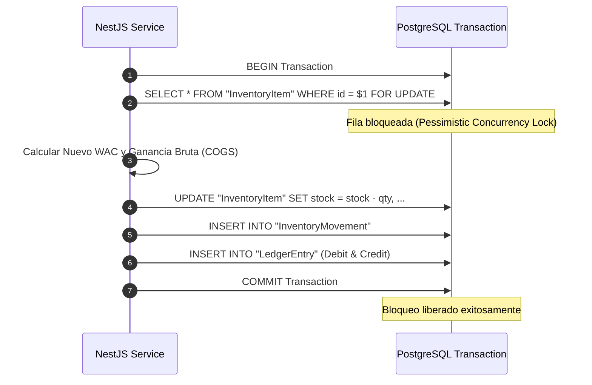

Para prevenir condiciones de carrera cuando se registran compras o ventas concurrentes sobre el mismo ítem, la operación ejecuta un bloqueo pesimista a nivel de fila (`SELECT ... FOR UPDATE` mediante raw SQL en la transacción de Prisma), garantizando la exactitud del costo de ventas.

### 8.4 Gestión Desacoplada de Proveedores y Clientes

#### 8.4.1 Proveedores (`Supplier`)
* Un proveedor es una contraparte comercial externa (persona natural o jurídica) con datos de contacto y condiciones comerciales.
* **No requiere obligatoriamente una cuenta de usuario (`User`)** en la plataforma.
* Si un miembro de la institución actúa como proveedor, su ficha comercial se vincula a su `InstitutionalPerson` sin duplicar su identidad.

#### 8.4.2 Clientes (`Customer`)
* Un cliente representa el receptor de una venta o servicio.
* Soporta tanto clientes identificados vinculados a una identidad (`User -> Customer`, como estudiantes o maestros) como clientes externos genéricos o no registrados (`External Customer -> Customer`).

### 8.5 Venta de Activos Patrimoniales

Todas las PYMES pueden comercializar tanto bienes de inventario regular como **determinados activos patrimoniales** cuando la política de la organización lo autorice (ej. venta de un juego de ajedrez seminuevo o equipamiento amortizado).

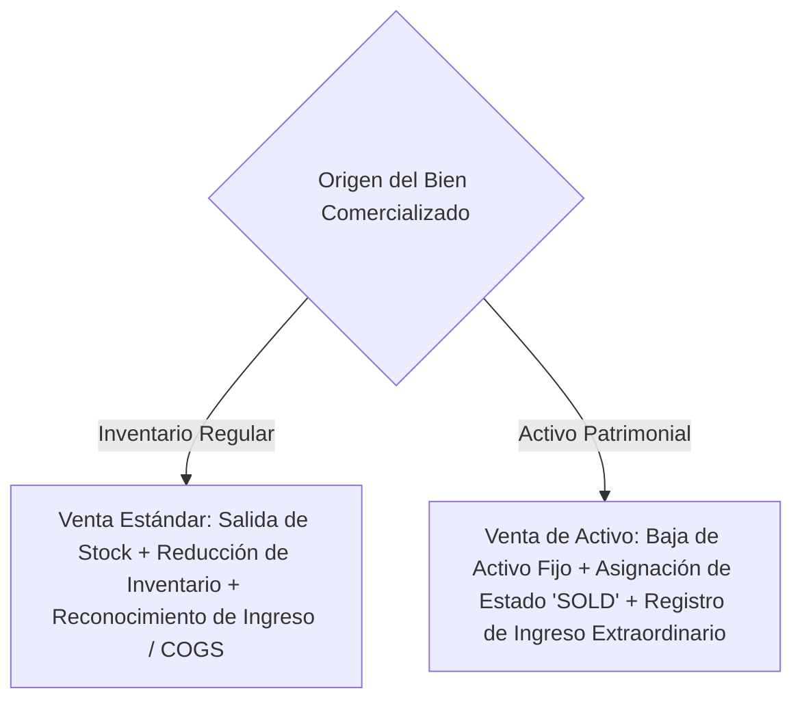

La venta de un activo da de baja la unidad patrimonial (`AssetStatus.SOLD`), registra la contrapartida contable correspondiente y no afecta el stock del inventario regular.

---

## 9. Especificaciones de Organizaciones y PYMES

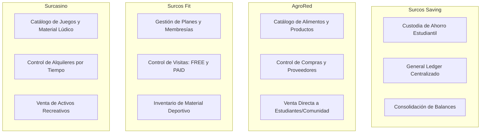

### 9.1 AgroRed — PYME Comercial y Agrícola

* **Giro de Negocio:** Comercialización de productos alimenticios, cosechas y refrigerios saludables.
* **Catálogo:** Productos agrícolas clasificados por unidades de medida específicas (`UNIT`, `DOZEN`, `KILOGRAM`, `POUND`, `LITER`, `BUNCH`).
* **Flujo Operativo:** Compra directa a productores/proveedores con actualización automática de WAC $\rightarrow$ Recepción en inventario $\rightarrow$ Venta por mostrador a estudiantes y miembros de la comunidad escolar.

### 9.2 Surcos Fit — PYME de Acondicionamiento Físico

* **Giro de Negocio:** Servicios de entrenamiento, gimnasio escolar y fomento de salud física.
* **Gestión de Visitas (`GymVisit`):**
  * Toda visita al gimnasio se registra en el sistema indicando: estudiante/cliente, fecha y hora de ingreso, usuario operativo que registra y modalidad.
  * **Modalidad Gratuita (`VisitType.FREE`):** Registro de control de aforo y asistencia sin impacto económico.
  * **Modalidad Pagada (`VisitType.PAID`):** Registro de visita puntual o cargo por sesión con cobro monetario y emisión automática del asiento contable en el ledger.
* **Membresías:** Control de suscripciones mensuales o periódicas con estado de vigencia y registro de pagos.
* **Custodia:** Inventario y activos de pesas, máquinas y material de entrenamiento.

### 9.3 Surcasino — PYME de Recreación y Alquiler de Juegos

* **Nombre Oficial Aprobado:** `Surcasino` (aprobado formalmente por las autoridades de la institución).
* **Giro de Negocio:** Servicio de alquiler temporal y venta de material recreativo escolar (juegos de mesa como ajedrez, damas, Jenga, ping-pong, balones de fútbol y básquetbol).
* **Flujo de Alquiler (`Rental`):**
  1. Selección del ítem recreativo (clasificado como Activo o Ítem de Alquiler).
  2. Registro del cliente (estudiante o miembro escolar) y usuario operativo responsable.
  3. Fijación de hora de inicio, tiempo estimado y tarifa por hora o fracción.
  4. Liquidación al término del alquiler, validación del estado del bien devuelto y registro de la transacción en el ledger.
* **Venta:** Capacidad de vender juegos nuevos (inventario) o juegos utilizados/amortizados (activos disponibles para venta).

---

## 10. Inteligencia Artificial y RAG Documental

### 10.1 Arquitectura del Módulo de IA

La plataforma incorpora un asistente analítico basado en Modelos de Lenguaje (LLM - Gemini) orquestado con LangChain y enriquecido con Recuperación Aumentada por Generación (RAG) sobre PostgreSQL (`pgvector`).

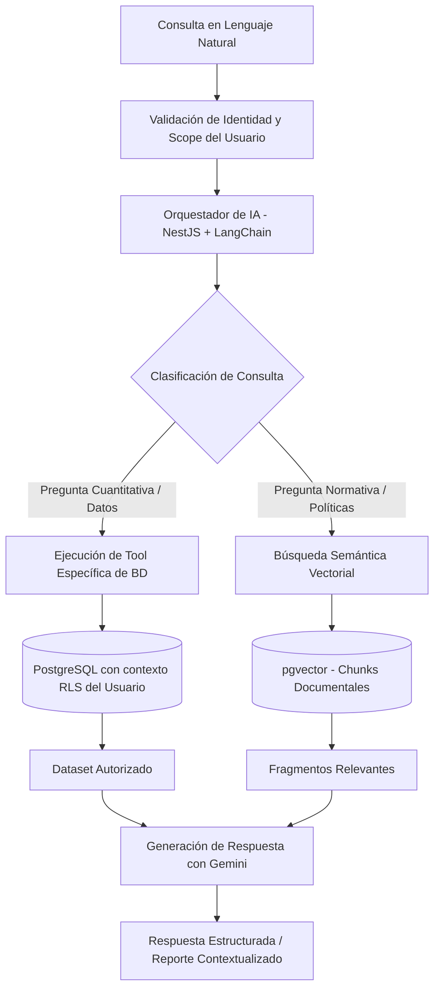

### 10.2 Principios de Seguridad Estricta en IA

1. **Aislamiento de Privilegios:** El motor de IA **no posee conexión con privilegios de superusuario ni `service_role`**. Toda consulta a la base de datos se ejecuta bajo el contexto de seguridad y claims del JWT del usuario autenticado.
2. **Prohibición de SQL Dinámico Libre:** El modelo de lenguaje no genera cadenas de SQL arbitrarias. El orquestador le proporciona un catálogo de herramientas (*tools*) predefinidas con tipado estricto (ej. `getStudentExpensesSummary(studentId)`, `getOrgMonthlySales(orgId)`).
3. **Protección contra Prompt Injection:** El contenido recuperado de manuales o documentos normativos se formatea como bloque de datos aislado, imposibilitando que instrucciones maliciosas contenidas en textos modifiquen las directivas del sistema (*System Prompt*).
4. **Auditoría de Invocaciones:** Cada interacción de IA se registra en `AuditLog` detallando el usuario, los parámetros de las herramientas invocadas y la latencia del proceso.

---

## 11. Arquitectura Técnica de Grado Enterprise

### 11.1 Diagrama de Arquitectura de Capas

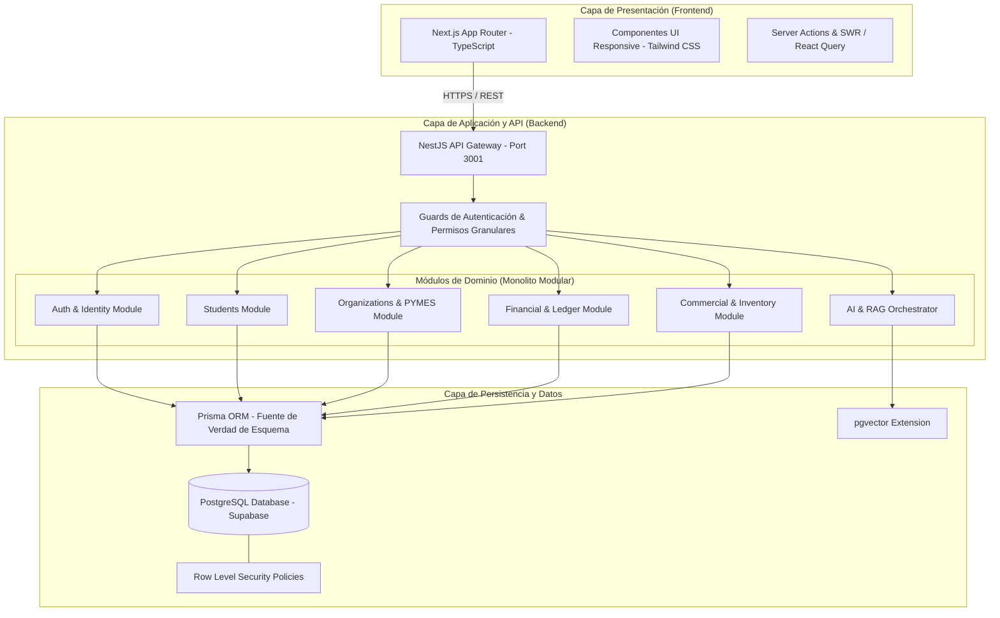

### 11.2 Principios de Diseño de Backend
* **Monolito Modular de Alto Desacoplamiento:** Organización estricta por módulos de NestJS con interfaces y contratos de servicio bien definidos. Permite escalabilidad y futura extracción a servicios independientes sin reescribir la lógica de dominio.
* **Separación de Responsabilidades:** Arquitectura en capas claras:
  * *Controllers:* Mapeo de rutas, serialización y validación de DTOs con `class-validator`.
  * *Services / Use Cases:* Lógica de negocio y orquestación transaccional.
  * *Repositories / Prisma:* Acceso a datos e integridad relacional.
* **Contrato de API Uniforme:** Respuestas consistentes y manejo centralizado de excepciones con `HttpExceptionFilter`, devolviendo siempre:

```json
{
  "statusCode": 400,
  "error": "BAD_REQUEST",
  "message": "Descripción clara del error de negocio",
  "requestId": "c1f0a2d5-89b4-4b9d-92a1-123456789abc",
  "timestamp": "2026-08-15T17:21:00.000Z"
}
```

### 11.3 Pipeline de Integración y Despliegue Continuo (CI/CD)

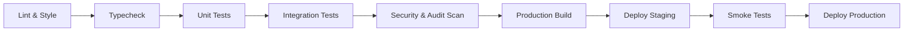

---

## 12. Seguridad Enterprise y Defensa en Profundidad

### 12.1 Flujo de Seguridad End-to-End

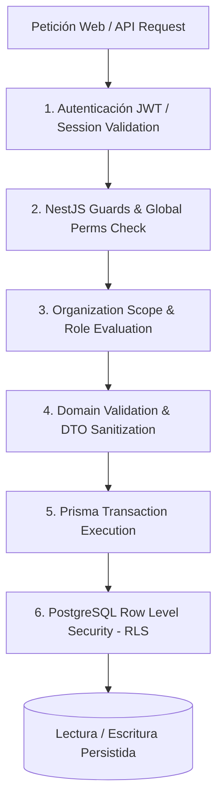

### 12.2 Políticas de Seguridad Clave
1. **Defensa en Profundidad:** Ningún nivel de la aplicación asume que el nivel anterior realizó una validación infalible. Si la validación de UI o de Guards fallara por cualquier defecto, las políticas de Row Level Security (RLS) en PostgreSQL impiden el acceso no autorizado a los registros.
2. **Principio de Menor Privilegio (*Least Privilege*):** Todo usuario nuevo o miembro de PYME inicia sin permisos concedidos salvo los mínimos necesarios para su rol.
3. **Protección de Credenciales y Secretos:** Las llaves administrativas (`SUPABASE_SERVICE_ROLE_KEY`) residen exclusivamente en variables de entorno seguras del backend y jamás se transmiten al cliente frontend.
4. **Cabeceras de Seguridad:** Implementación de cabeceras HTTP estrictas mediante `helmet` (Content Security Policy, X-Frame-Options: DENY, HSTS, X-Content-Type-Options: nosniff).
5. **Caducidad de Sesión en Entornos Compartidos:** Sesiones configuradas con tiempos de expiración reducidos e invalidación automática ante inactividad, adaptadas para terminales compartidos en laboratorios educativos.
6. **Cumplimiento de Protección de Datos de Menores (LOPDP):** El registro y tratamiento de información financiera de estudiantes menores de edad requiere el consentimiento del representante legal vinculado mediante el token de invitación.

---

## 13. Auditoría, Trazabilidad y Observabilidad

### 13.1 Registro de Auditoría Inmutable (`AuditLog`)

Toda operación que afecte el estado del sistema, modifique precios, ejecute transacciones financieras o altere membresías y permisos genera de forma sincrónica un registro en `AuditLog`:

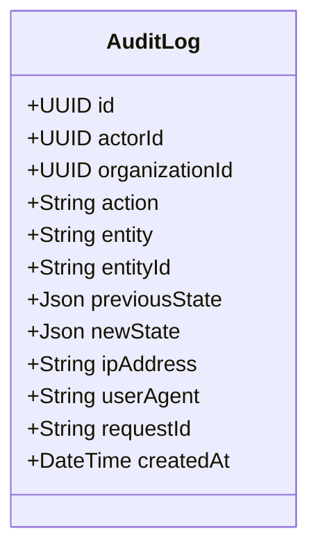

### 13.2 Observabilidad del Sistema
* **Logs Estructurados en Formato JSON:** Emisión de logs enriquecidos mediante `pino` conteniendo `requestId`, `actorId`, `organizationId` y tiempos de respuesta.
* **Monitoreo de Salud (*Health Checks*):** Endpoint estándar `/health` que reporta el estado operativo de la conexión a PostgreSQL, el pool de conexiones de Prisma y la latencia de servicios externos.
* **Trazabilidad de Errores:** Integración con capturador de excepciones (Sentry) para diagnóstico en tiempo real de fallos en producción.

---

## 14. Requisitos No Funcionales y Criterios de Aceptación

### 14.1 Requisitos No Funcionales

* **Rendimiento:** Tiempos de respuesta en consultas de dashboard $\le 1.5\text{ s}$ bajo condiciones estándar de carga. Operaciones de registro y lectura transaccional $\le 500\text{ ms}$.
* **Disponibilidad y Resiliencia:** Esquema de copias de seguridad continuas y automáticas de la base de datos con objetivos de recuperación de $RPO \le 1\text{ hora}$ y $RTO \le 4\text{ horas}$.
* **Integridad Numérica:** Cero tolerancia a discrepancias de balance en el libro contable mayor.

### 14.2 Criterios de Aceptación Verificables

* [ ] **Registro Institucional:** Solo se aceptan correos `@colegiosurcos.edu.ec` en `/auth/register`. El sufijo `_est` asigna automáticamente la identidad `Student` y crea la cuenta de ahorro.
* [ ] **Invitación de Representantes:** Los padres se registran con cualquier correo únicamente mediante enlace tokenizado único (`maxUses = 1`), asociándose inequívocamente con el estudiante emisor.
* [ ] **Gobernanza de PYMES:** Cada PYME cuenta con exactamente un `ADMIN`. Los demás miembros son `USER` y sus facultades están reguladas por permisos modulares explícitos.
* [ ] **Restricciones del Estudiante:** El estudiante navega sin barra lateral y no puede crear ventas, compras, productos ni alterar inventarios ni el *ledger* (validado en UI, Guards y RLS).
* [ ] **Separación Patrimonial:** El sistema modela de forma diferenciada inventario comercial, activos patrimoniales y pasivos en todas las organizaciones.
* [ ] **Modelo Sin Impuestos:** Todas las transacciones comerciales calculan $\text{Total} = \text{Subtotal} - \text{Descuentos}$, sin campos ni recargos de IVA o tributos.
* [ ] **Partida Doble e Idempotencia:** Toda transacción financiera genera asientos con balance exacto entre débitos y créditos y respeta la cabecera `Idempotency-Key`.
* [ ] **Seguridad en IA:** Las consultas del asistente de IA se ejecutan estrictamente bajo las restricciones de RLS y permisos del usuario autenticado, utilizando tools predefinidas y excluyendo SQL libre.

---

## 15. Roadmap de Evolución del Producto

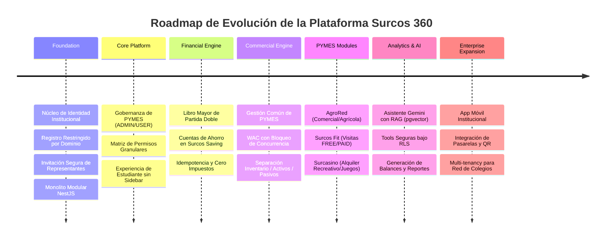

1. **Foundation:** Establecimiento de la arquitectura base, esquemas relacionales en Prisma, servicios de autenticación y tokens criptográficos.
2. **Core Platform:** Implementación del modelo de gobernanza por PYME, panel de administración para autoridades y portal estudiantil optimizado.
3. **Financial Engine:** Despliegue del motor contable general de partida doble, cuentas financieras estudiantiles y mecanismos de idempotencia.
4. **Commercial Engine:** Estandarización de módulos de inventario, activos, pasivos, proveedores, compras y ventas con cálculo de WAC bajo concurrencia.
5. **PYMES Modules:** Puesta en producción de los modelos especializados para AgroRed, Surcos Fit y Surcasino.
6. **Analytics & AI:** Activación del orquestador inteligente, búsqueda vectorial documental y generación automatizada de estados financieros.
7. **Enterprise Expansion:** Evolución hacia aplicaciones móviles nativas, control de acceso por código QR y capacidad multi-institucional.
